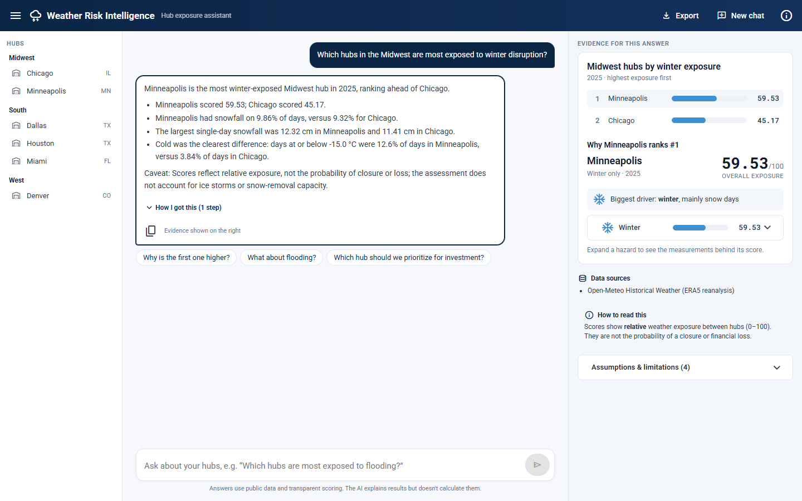

# Weather Risk Intelligence Agent

A chat assistant for a logistics company that ranks and compares US distribution hubs by
weather and natural-hazard exposure (winter, flood, hurricane, heat). It is built on public
weather and hazard data and explains every answer.

The LLM only plans which deterministic capabilities to call and explains their results. Every
score, ranking, comparison and statistic comes from transparent, deterministic Python. Each
answer shows its evidence, data sources and caveats.



Ask, for example:

- *Which hubs in the Midwest are most exposed to winter disruption?*
- *Compare Miami and Houston in terms of hurricane and flood exposure.*
- *What percentage of days in Denver last year had snowfall?*
- *Why is the Dallas hub's weather disruption risk high?*

…and follow up naturally: *"Why is the first one higher?"*, *"What about heat?"*, *"How many
days is that?"*.

## Quick start

Requirements: Python 3.12+ with [uv](https://docs.astral.sh/uv/), Node.js 22+ with npm, and an
OpenAI or Anthropic API key for the chat.

```bash
uv sync                                     # Python dependencies
cp .env.example .env                        # then set the LLM provider and key, e.g.
                                            #   WRI_LLM__PROVIDER=openai
                                            #   WRI_LLM__API_KEY=sk-...
(cd frontend && npm ci && npm run build)    # build the chat UI once

uv run uvicorn weather_risk.main:app        # chat UI   http://127.0.0.1:8000/
                                            # API docs  http://127.0.0.1:8000/docs
```

Without an API key everything except the chat works, and `/chat` explains how to enable it.

**Conversations are saved** in `data/weather_risk.db` (SQLite, created on first run). Restart
the app, or copy the project with that file to another PC, and the side panel lists the same
conversations; the most recent one reopens with its answers and evidence.

### Development and tests

```bash
uv run uvicorn weather_risk.main:app --reload       # API with auto-reload
cd frontend && npm start                            # UI with live reload on :4200 (proxies the API)

uv run pytest                                       # backend: 684 tests, offline
cd frontend && npx ng test --watch=false            # frontend: 43 tests

uv run python -m evals.run                          # grade the latest recorded evaluation run (no LLM calls)
uv run python -m evals.run --live                   # record and grade a new run (about 2-3 LLM calls per turn)
```

## How it works

```
Browser ─► POST /chat ─► ChatRuntime
                           1. load the conversation          (SQLite)
                           2. LLM plans capability calls      → validated JSON AgentPlan
                           3. agent runs the capabilities     → use cases → deterministic domain
                              (2-3 repeat only if the plan needs results first; max 3 rounds)
                           4. LLM writes the answer from the results
                           5. the turn is saved atomically
                      ◄─ answer + trace + warnings + structured results (rendered as evidence)
```

| Capability | Answers |
|---|---|
| `list_hubs` | Which hubs exist |
| `get_weather_metrics` | Factual statistics, e.g. % of snowfall days |
| `get_hazard_data` | Raw hazard data: GloFAS river discharge, NOAA hurricane tracks near a hub |
| `analyze_hub_risk` | One hub's 0-100 exposure scores with the factors behind them |
| `rank_hubs` | Hubs ranked by exposure (optionally by region or hazard) |
| `compare_hubs` | Two or more hubs side by side, per hazard |

**Data sources:**
- Open-Meteo historical weather (ERA5 reanalysis);
- Open-Meteo Flood API (Copernicus GloFAS river discharge);
- NOAA National Hurricane Center HURDAT2 best-track data.

**Structured LLM output:** the plan is JSON validated against a Pydantic schema, with bounded
repair. Transport retries, blank-response retries and schema repair are separate, configurable
mechanisms.

## Assumptions and scope

- **Exposure, not loss.** Scores (0-100) compare *relative* weather/hazard exposure between hubs
  over the same period. They are not probabilities of closure or financial loss, and every
  answer says so.
- **Transparent model.** Each hazard score is a weighted sum of 2-3 normalized factors with
  documented thresholds. The overall score is a weighted mean (winter 0.25, flood 0.25,
  hurricane 0.30, heat 0.20). Everything is configurable.
- **Data limits are surfaced, not hidden:**
  - weather is modelled reanalysis, not station readings;
  - flood uses the nearest modelled river cell;
  - hurricane exposure uses a 30-year climatology;
  - NOAA data ends at its last published season, and a warning is shown.
- **Scope:** six hubs (`data/hubs.json`, editable without a restart) and four hazards. Other
  hazards (earthquake, wildfire, …) are declined explicitly.
- **Default period:** the last complete calendar year.
- **Investment prioritization is exposure-based.** "Which hub should we prioritize?" is answered
  from the deterministic ranking (all hubs, or the region or hazard asked for), naming the top
  hub(s) and their main hazards. It is not a capital-allocation model: cost, shipment volume,
  asset value, existing resilience and ROI are not modelled, and every answer says so.
- **Conversation memory is context, not evidence.** Follow-ups reuse the hubs, hazards and
  period from earlier turns, but numbers are always re-fetched through a capability in the
  current turn; they are never copied from earlier answers.

Details: [docs/SCORING.md](docs/SCORING.md).

## Evaluation

[`evals/`](evals) holds 17 conversation cases (27 turns). They cover the four questions above,
follow-ups, multi-step planning, scope, investment prioritization, re-fetching recalled numbers
and an attempt to override a score. Every number in an
answer must be found in that turn's deterministic results.

The latest full run (OpenAI `gpt-6-luna`) scored **17 PASS · 0 PARTIAL · 0 FAIL**; see
[docs/EVALUATION.md](docs/EVALUATION.md).

## Documentation

| Document | Contents |
|---|---|
| [docs/ARCHITECTURE.md](docs/ARCHITECTURE.md) | Short design document: system architecture, repository structure, **data storage choice** |
| [docs/SCORING.md](docs/SCORING.md) | Data sources, hazard data, scoring formulas, thresholds, worked example, assumptions and limitations |
| [docs/API.md](docs/API.md) | HTTP endpoints, examples, errors, chat and saved-conversation API |
| [docs/CONFIGURATION.md](docs/CONFIGURATION.md) | Every setting and its default |
| [docs/EVALUATION.md](docs/EVALUATION.md) | Evaluation set, grading, results and findings |
| [frontend/README.md](frontend/README.md) | Chat UI structure |
| [docs/screenshots](docs/screenshots) | UI screenshots |

## AI session

The project was built with AI assistants (Claude Code, ChatGPT). The full session transcripts
are exported by the author and added to [docs/ai-session/](docs/ai-session).
