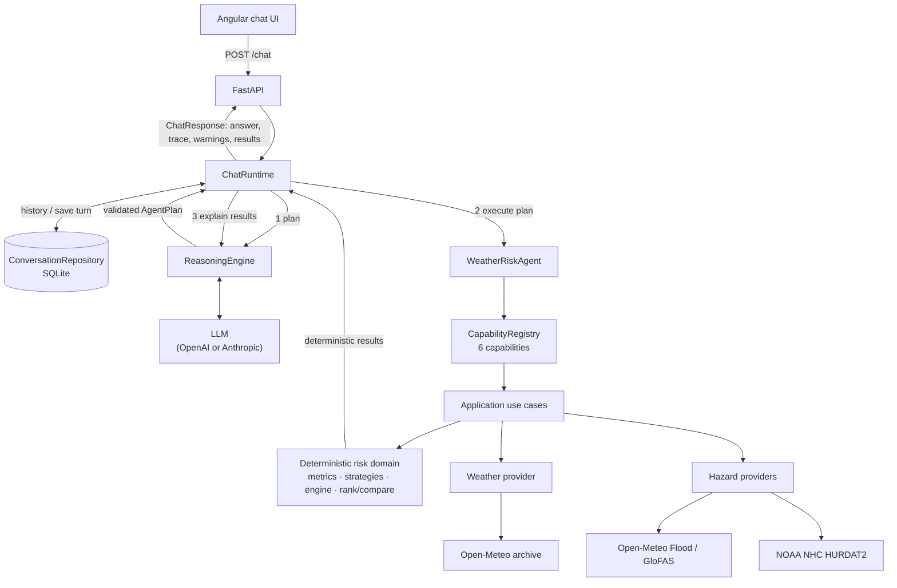

# Architecture

A short design document for the Weather Risk Intelligence Agent: how the system is built,
how the repository is organized, and where data is stored. Scoring details are in
[SCORING.md](SCORING.md), the HTTP API in [API.md](API.md) and the evaluation in
[EVALUATION.md](EVALUATION.md).

## 1. System architecture



One chat turn:

1. **Load context.** `ChatRuntime` reads the session's earlier turns from SQLite. They resolve
   follow-ups ("What about heat?", "Why is the first one higher?").
2. **Plan.** `ReasoningEngine` asks the LLM to turn the question into an `AgentPlan`: a JSON
   list of capability calls. The reply is validated against the plan's JSON schema (Pydantic,
   unknown fields rejected) and repaired a bounded number of times. Raw LLM text never reaches
   the agent.
3. **Execute.** `WeatherRiskAgent` runs only registered capabilities and validates each call's
   arguments. The capabilities call the application use cases, which fetch weather and hazard
   data and compute scores, rankings and statistics in deterministic code. If the plan asks to
   see results first, steps 2–3 repeat, at most 3 times.
4. **Explain.** `ReasoningEngine` asks the LLM to write a short answer from those results.
5. **Save and respond.** The turn is saved atomically. The response carries the answer, a
   safe action trace, warnings, and the structured results the UI shows as evidence.

**Who does what:**
- The LLM understands the question, chooses capabilities and explains results.
- The LLM does **not** calculate authoritative scores; every score, ranking and statistic comes
  from deterministic code.
- Conversation history is context only. A number needed again is re-fetched through a
  capability in the current turn.
- The model's internal reasoning is never stored or returned.

## 2. Component responsibilities

| Layer | Components | Responsibility |
|---|---|---|
| Presentation | FastAPI app (`/chat`, `/chat/sessions`, `/hubs`, data endpoints); Angular chat UI | HTTP, request/response schemas, error mapping; serves the built UI |
| Agent | `ChatRuntime`, `ReasoningEngine`, `WeatherRiskAgent`, `CapabilityRegistry` | Turn orchestration; LLM planning and answer writing; validated plan execution; the six capabilities (`list_hubs`, `get_weather_metrics`, `get_hazard_data`, `analyze_hub_risk`, `rank_hubs`, `compare_hubs`) |
| Application | `RankHubs`, `CompareHubs`, `AnalyzeHubRisk`, `GetWeatherMetrics` use cases; hub, weather and hazard services | One use case per business operation; fetches only the data a request needs |
| Domain | Weather metrics, normalization, hazard strategies (winter, flood, hurricane, heat), `RiskScoringEngine`, ranking and comparison | Pure, deterministic Python; no I/O |
| Infrastructure | LLM providers (OpenAI, Anthropic) behind one port; Open-Meteo weather; Open-Meteo Flood / GloFAS; NOAA HURDAT2; SQLite conversation repository; in-memory TTL cache; JSON hub repository; settings | All external systems and storage |

Dependencies point inward: domain and application never import the agent, infrastructure or
frameworks. `container.py` wires everything together, and architecture tests enforce the rules.

## 3. Repository structure

```
src/weather_risk/
  domain/             Hubs, weather, hazards and the deterministic scoring model
  application/        Use cases (use_cases/) and services; ports for external data
  agents/
    core/             Generic agent machinery: plan schema, structured LLM client, runtime
    weather_risk/     The agent's instructions, scope and six capabilities
  infrastructure/     Data providers, LLM providers, SQLite, cache, hub file, settings
  presentation/       FastAPI app and routers
  container.py        Composition root: builds the object graph
  main.py             ASGI entry point
frontend/             Angular 22 + Angular Material chat UI
evals/                Evaluation cases, grader, runner and recorded runs
data/                 hubs.json (hub catalogue); weather_risk.db is created at runtime
docs/                 Architecture, scoring, API, configuration, evaluation, AI session
tests/                Unit and integration tests (offline, scripted LLM)
```

## 4. Data storage choice

### Hub catalogue: JSON (`data/hubs.json`)
- Six fixed hubs: name, state, region, coordinates.
- Simple, human-editable and version-controlled; no database needed.
- Validated at startup and re-read when the file changes, so edits apply without a restart.

### Conversations: SQLite (`data/weather_risk.db`)
- Lightweight local persistence that survives server restarts, with no external
  infrastructure; SQLite ships with Python.
- Each turn stores the question, the answer and the full response (action trace, warnings,
  capability results). The UI can list past conversations and reopen them with their evidence.
- A turn is written in one transaction; a retried question (same `turn_id`) replaces its turn
  instead of duplicating it.
- The file is runtime data, created automatically and ignored by Git. Tests and evaluation
  runs use an in-memory store and never touch it.

### External weather and hazard data: fetched live, cached in memory
- Open-Meteo archive (daily weather), Open-Meteo Flood API (GloFAS river discharge) and NOAA
  NHC HURDAT2 (hurricane tracks) are queried when a request needs them.
- Results are cached in memory with a TTL (weather 30 min, hazard results 6 h, the parsed
  HURDAT2 dataset 24 h). The cache only avoids repeat calls; the public sources stay the source
  of truth, and no permanent copy is kept.
- Scores are recomputed on every request (milliseconds once inputs are cached), so they always
  reflect the current weights and thresholds.

### Evaluation dataset: JSON (`evals/cases.json`)
- Version-controlled test data, not application persistence. Recorded live runs and their
  graded reports are kept in `evals/runs/` as evidence.

## 5. Key design decisions

- **Deterministic scoring, not LLM-generated scores.** Transparent factors, weights and
  thresholds the LLM can explain but not change.
- **Structured `AgentPlan` validated before execution.** JSON schema plus Pydantic, bounded
  repair. Transport retries, blank-response retries and schema repair are separate.
- **Vertical application use cases.** One entry point per business operation, shared by the
  agent and the HTTP API.
- **Provider abstractions** for weather, hazard and LLM APIs. Swapping a source or LLM vendor is
  a new adapter plus one line in `container.py`.
- **Bounded agent execution.** At most 3 planning rounds and 4 actions per plan; duplicate calls
  are skipped; capability failures become observations, not crashes.
- **SQLite instead of external database infrastructure,** sized for a take-home. The
  `ConversationRepository` port allows PostgreSQL later without touching the agent.

## 6. Limitations

- Scores show relative weather exposure, not the probability of shutdown or financial loss.
- Investment prioritization is exposure-based only. Costs, ROI, existing resilience and
  business criticality are not modelled.
- Conversations are stored in a local SQLite file, suitable for one app instance.
- Public APIs can fail or rate-limit; failures are retried with backoff, then reported.
- The model covers four hazards: winter, flood, hurricane and heat.
